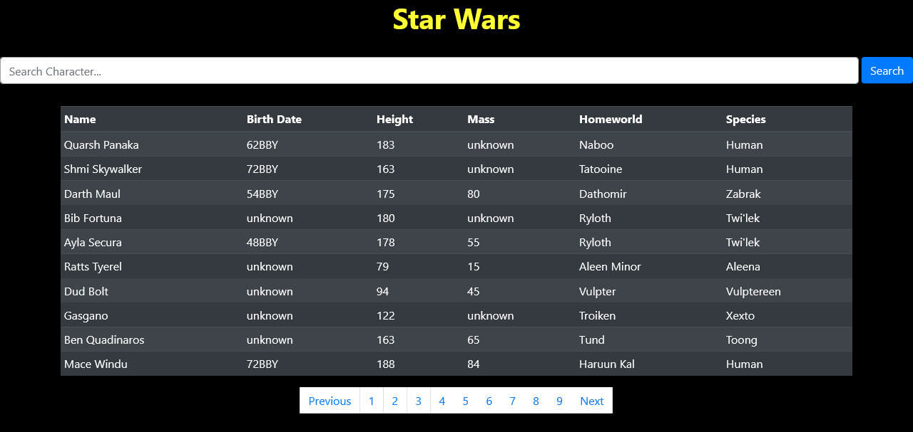

# Star Wars API APP

A Star Wars App database utilzing data from a Rest API created with React and Bootstrap

### Check it out [here](https://serene-bastion-00739.herokuapp.com/)

## Summary

Another React project I would say was the most challenging app I have ever built up to this point. I wanted to familiarize myself with using hooks, so I forced myself to use them to render everything on the screen. What made this app so difficult was learning how to work with Rest APIs and getting the URL's into my app by utilziig axios and JS promises. However, once I figured out everything it was fun being able to learn how to interact with an API and create my own app. If there is one thing I learned from this app is how React can make building software simpler once you get a hang of the framework. I enjoyed learning the simplicity of hooks and saw the usefulness of using react components such as pagination. 

## Author

Dante Leeseberg - Full Stack Software Developer [LinkedIn](https://www.linkedin.com/in/dante-leeseberg-bba05883/)
| Website coming soon.
